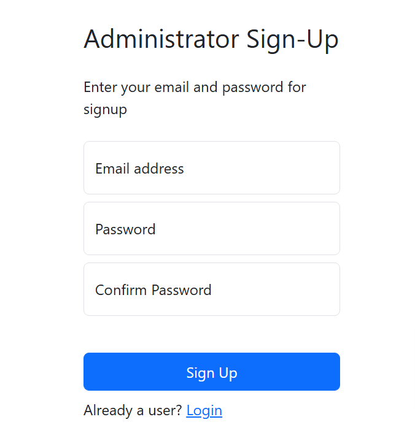
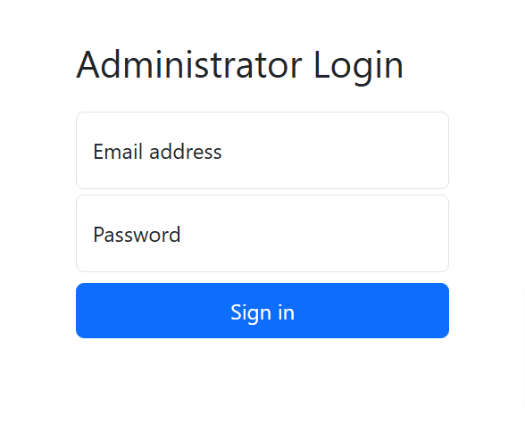
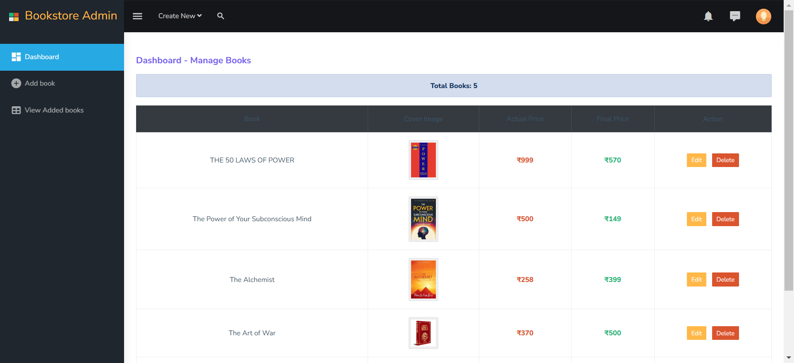
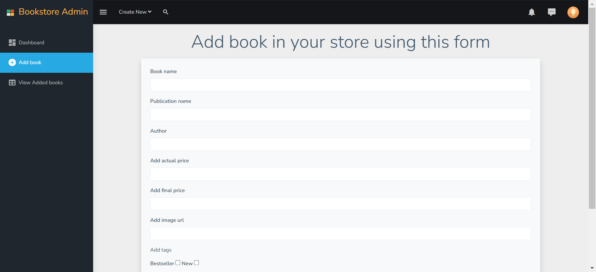
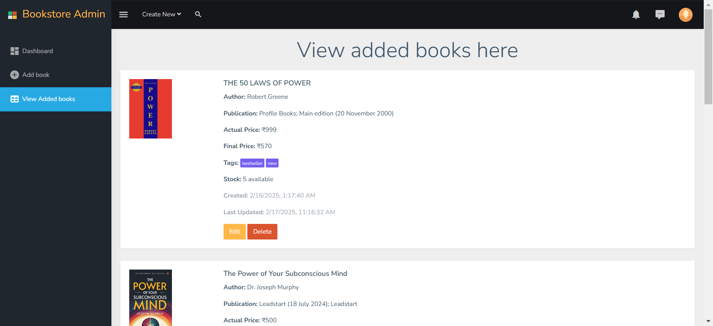
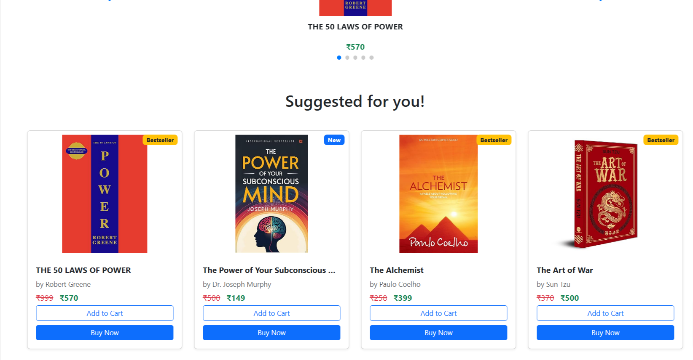

# BookStore Project using Express.js and MongoDB

## Description
This project aims to create a basic-level, fully-fledged website with separate admin and user pages.

### Features:
- **Admin Pages** (Divided into 3 parts):
  1. Sign Up
  2. Sign In
  3. Admin Panel
- **User Page**:
  - Homepage

### Multi-Admin Use Case:
Designed for websites managed by multiple administrators from different locations. Ideal for scenarios where a manager delegates administrative tasks to subordinates while maintaining oversight from another device.

## Tech Stack
- **Node.js**
- **Express.js**
- **MongoDB**

## Live Demo
[Live Link Here](https://book-store-project-express-js.onrender.com)

## Screenshots
### 1 - Admin Signup and Signin Screens

The admin can set their custom id password. 

The admin must provide his/her authentication details to proceed to admin panel

### 2 - Admin Panel 

the admin can get a quick view and take actions from the dashboard.

the admin can add books to the database using this form.

the admin can view books added by him. all details are available in JSON like format. (insipred by mongodb compass app).

### 3 - Homepage 

its the Homepage of the website which will appear when someone searches the website. 

---
Feel free to contribute or suggest improvements!

